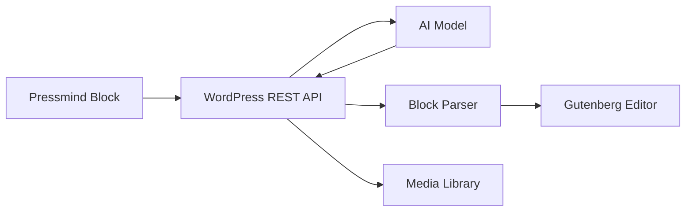

<p align="center">
	<picture>
		<source media="(prefers-color-scheme: dark)" srcset="assets/logo-dark.svg" />
		<source media="(prefers-color-scheme: light)" srcset="assets/logo-light.svg" />
		
	</picture>
</p>

<p align="center">
	<strong>Prompt-powered Gutenberg composition for WordPress.</strong>
</p>

<p align="center">
	<a href="https://playground.wordpress.net/?blueprint-url=https://raw.githubusercontent.com/f/pressmind/main/blueprint.json">
		
	</a>
	<a href="https://playground.wordpress.net/?blueprint-url=https://raw.githubusercontent.com/f/pressmind/main/blueprint-nightly.json">
		
	</a>
</p>

<p align="center">
	<a href="#quick-start">Quick start</a>
	 ·
	<a href="#security-model">Security model</a>
</p>

<p align="center">
	
	
	
</p>

## What Is Pressmind?

Pressmind is an experimental WordPress plugin that turns natural language prompts into real Gutenberg blocks. It reads the current post context, streams model output in the editor, and replaces the prompt block with generated content.

It can create static layouts, rich HTML, SVG diagrams, org charts, tables, callouts, sandboxed interactive widgets, and Media Library-backed AI images.

<p align="center">
	<video src="https://github.com/user-attachments/assets/911b3718-3716-42cb-b5ca-8955757431ea" controls width="100%"></video>
	<br />
	<a href="https://github.com/f/pressmind/raw/refs/heads/main/assets/pressmind-demo.mp4">Watch the demo video</a>
</p>

## Example Output

<p align="center">
	
</p>

<p align="center">
	<a href="https://playground.wordpress.net/?blueprint-url=https://raw.githubusercontent.com/f/pressmind/main/blueprint-mental-health.json">
		
	</a>
	<br />
	<sub>Loads <a href="examples/mental-health-interactive-news.html"><code>examples/mental-health-interactive-news.html</code></a> as a Gutenberg post in a fresh Playground site.</sub>
</p>

## Highlights

- **Context-aware generation**: Sends bounded post context so generated blocks match the current article.
- **Streaming editor feedback**: Shows model output while the backend is generating.
- **Real Gutenberg output**: Returns serialized block markup and inserts parsed blocks into the editor.
- **Smart rendering mode**: Keeps simple HTML/SVG as `core/html`; moves scripts/styles into an isolated sandbox block.
- **Editable generated blocks**: Refine selected HTML or sandbox blocks with AI using the existing code as context.
- **Sandboxed interactivity**: Games, calculators, and scripted UI render in an iframe with no same-origin access.
- **Optional image generation**: Generates images with OpenAI Images, imports them into the Media Library, and inserts `core/image` blocks.

## Demo

### Local Playground

```bash
npm install
npm run playground
```

This builds the block assets and starts a local WordPress Playground instance with auto-login on the latest stable WordPress build.

To test against WordPress nightly for upcoming WordPress 7.0 APIs such as Connectors:

```bash
npm run playground:nightly
```

### Hosted Playground Blueprint

This repository includes two WordPress Playground blueprints:

- [`blueprint.json`](blueprint.json): stable demo using the latest released WordPress build.
- [`blueprint-nightly.json`](blueprint-nightly.json): nightly demo for testing upcoming WordPress 7.0 APIs such as Connectors.
- [`blueprint-mental-health.json`](blueprint-mental-health.json): opens the [mental-health interactive news example](examples/mental-health-interactive-news.html) as a Gutenberg post.

Open Pressmind in a fresh browser-based WordPress site:

<p>
	<a href="https://playground.wordpress.net/?blueprint-url=https://raw.githubusercontent.com/f/pressmind/main/blueprint.json">
		
	</a>
	<a href="https://playground.wordpress.net/?blueprint-url=https://raw.githubusercontent.com/f/pressmind/main/blueprint-nightly.json">
		
	</a>
</p>

Both blueprints enable networking, log into wp-admin, install Pressmind from GitHub, activate the plugin, and open a new post.
That post is imported from [`examples/pressmind-demo-post.html`](examples/pressmind-demo-post.html) and includes prefilled Pressmind prompt placeholders. They are not sent to AI until you click **Generate Blocks**.

For a fully generated longform example, see [`examples/mental-health-interactive-news.html`](examples/mental-health-interactive-news.html). It mimics Pressmind output for an interactive mental-health news feature with custom HTML, inline SVG, sandboxed charts, a playable breathing exercise, and resource guidance.

## Quick Start

```bash
npm install
npm run build
```

Then install the plugin in WordPress and activate **Pressmind**.

Go to `Settings > Pressmind` and configure:

- Credentials source: WordPress Connector or Pressmind custom settings
- Connector selection or custom API key/endpoint fields
- Text model
- Optional image generation model and size

On WordPress 7.0+, Pressmind can use API keys from the new WordPress Connectors API. If multiple API-key AI connectors are registered, choose one in `Settings > Pressmind`. Connector mode hides the custom API key and endpoint controls, but still lets you choose the model name. Choose Custom settings to show and use Pressmind’s own API key and endpoint fields instead.

## Example Prompts

```text
Create a comparison table from this post.
```

```text
Generate an accessible SVG org chart for the teams described here.
```

```text
Build a sandboxed tic-tac-toe game with modern styling.
```

```text
Generate a hero image for this post and insert it with a caption.
```

## How It Works



The backend asks the model for strict JSON with:

- `summary`: A short editor-facing description.
- `serializedBlocks`: Valid serialized Gutenberg block markup.
- `assets`: Optional generated media requests.
- `warnings`: Safe fallbacks or limitations.

## Security Model

- API keys are stored in WordPress options and used only server-side.
- REST endpoints require the current user to be able to edit the target post.
- Returned block markup is parsed, allowlisted, and sanitized before insertion.
- Static HTML and SVG use a conservative allowlist.
- Scripted or style-tagged content is isolated in `pressmind/sandbox`.
- Sandbox iframes use `sandbox="allow-scripts"` without same-origin access.
- Generated images are imported into the WordPress Media Library before insertion.

## Development

```bash
npm run start
npm run lint:js
npm run format
npm run build
```

Main files:

- [`pressmind.php`](pressmind.php): Plugin bootstrap and dynamic sandbox block rendering.
- [`includes/class-settings.php`](includes/class-settings.php): Admin settings.
- [`includes/class-ai-provider.php`](includes/class-ai-provider.php): AI and image provider calls.
- [`includes/class-rest-controller.php`](includes/class-rest-controller.php): REST generation and streaming.
- [`src/ai-prompt-block/`](src/ai-prompt-block): Block editor UI.
- [`examples/pressmind-demo-post.html`](examples/pressmind-demo-post.html): Playground demo post content.
- [`examples/mental-health-interactive-news.html`](examples/mental-health-interactive-news.html): Full generated article example with static visuals and sandboxed interactions.

## Status

Pressmind is experimental and intended for exploration, demos, and early feedback. Review generated code and content before publishing.

## License

GPL-2.0-or-later
